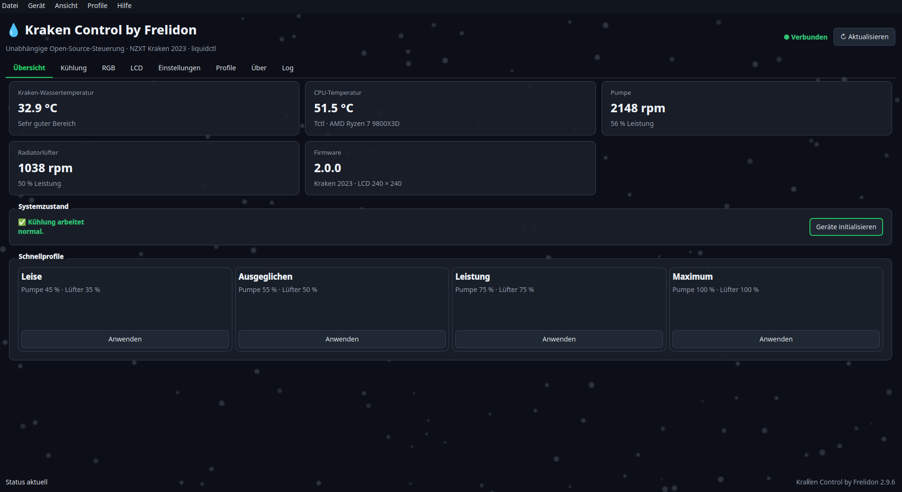

# Open Hardware Control by Frelidon 3.0.9 – NZXT Kraken & Corsair unter Linux

<!-- project-badges -->
[](https://github.com/Frelidon/kraken-control-linux/actions/workflows/ci.yml) [](LICENSE) [](https://github.com/Frelidon/kraken-control-linux/releases)
<!-- /project-badges -->

Open Hardware Control ist eine freie Linux-Oberfläche für **NZXT-Kraken-LCD**, Pumpe, Radiatorlüfter und RGB sowie für **Corsair-Geräte über OpenLinkHub**. Das Projekt richtet sich an Fedora, Nobara, Debian, Ubuntu, Linux Mint, Arch Linux, Manjaro, EndeavourOS und openSUSE.



<!-- project-repository -->
Projekt-Repository: <https://github.com/Frelidon/kraken-control-linux>
<!-- /project-repository -->

Version 3.0.9 macht die grafische OpenLinkHub-Mausansicht beschreibbar: Gemeldete Tasten können angeklickt und mit Medien-, Tastatur-, Maus- oder vorhandenen Makrofunktionen belegt werden. Ein bewusst fensterlokaler Tastaturmakro-Recorder ist enthalten. LCD-Hardwaredesigns zeigen keine kleinen LIVE-/Programmschriftzüge mehr und bieten getrennte Farben und Größen für Beschriftung und Temperaturzahl. Celsius/Fahrenheit gilt global für Oberfläche, Profile, Kurven und neu erzeugte LCD-Animationen.

## Neu in 3.0.9

- Klick auf eine gemeldete Maustaste öffnet den neuen Belegungsdialog
- Funktionsarten: keine Funktion, Medien-, DPI-, Tastatur-, Sniper-, Maus- oder vorhandene Makrofunktion
- Originalfunktion, Gedrückthalten und Ausführen beim Loslassen werden entsprechend der offiziellen OpenLinkHub-API unterstützt
- Tastaturmakros lassen sich mit Pausen innerhalb des aktiven Aufnahmedialogs erstellen; keine verdeckte systemweite Eingabeaufzeichnung
- Schreibaktionen bleiben sitzungsweise gesperrt, streng validiert und ausschließlich auf die lokale Loopback-API begrenzt
- LCD-Hardwarebilder enthalten keine kleinen `LIVE`, `LETZTER WERT` oder `KRAKEN CONTROL`-Zusätze mehr
- getrennte Hex-Farben und 60–200-%-Größenregler für Sensorbeschriftung und Temperaturzahl
- globale Einheit Celsius/Fahrenheit für Dashboard, Status, Kurventabellen/-diagramme, Sicherheitsgrenzen, Profile und LCD-Hardwareanimationen
- Kühlberechnung und gespeicherte Sicherheitswerte bleiben intern unverändert in Celsius

## Seit 3.0.6

- der aktive LCD-Modus wird ausdrücklich im Gesamt- oder LCD-Profil gespeichert
- normale GIFs und animierte Hardwaredesigns werden nach dem Neustart wieder als Animation gestartet
- ältere 3.0.5-LCD-Profile erkennen eine gespeicherte GIF-Datei automatisch als GIF-Modus
- beim Desktop-Autostart wartet die LCD-Wiederherstellung fünf Sekunden ab Programmstart
- der im Gesamtprofil gespeicherte maximierte Fensterzustand darf den minimierten Tray-Autostart nicht mehr überschreiben
- SIGTERM/Sitzungsende wird sauber verarbeitet, damit ein normaler Desktop-Neustart nicht fälschlich als LCD-Absturz gilt

## Seit 3.0.5

- Pumpenkurve und Radiatorlüfterkurve verwenden jetzt CPU-Temperatur statt Wassertemperatur
- echte laufende Software-Regelung über den Linux-CPU-Sensor (`k10temp`/hwmon)
- lineare Berechnung zwischen den Kurvenpunkten, geglättete CPU-Werte, Hysterese und begrenzte Schreibintervalle
- Pumpen- und Lüfteränderungen werden bei Bedarf in einem gemeinsamen USB-Fenster übertragen
- die CPU-Kurvenregelung bleibt auch während einer LCD-GIF- oder Hardwareanimation aktiv
- bisherige 20–50-°C-Wasserkurven werden beim Upgrade sicher durch CPU-Kurven ersetzt
- alle AMD-AM5-Profile besitzen angepasste CPU-Kurven; Ryzen 9000/8000G/7000 und 7000 X3D behalten getrennte Temperaturgrenzen
- die Wassertemperatur bleibt unabhängig als Warn-, Kritisch- und 100-%-Notfallschutz erhalten
- fällt der CPU-Sensor mehrfach aus, werden aktive Kurvenkanäle vorsorglich auf 75 % gesetzt
- bei einem echten Programmende wird für aktive CPU-Kanäle eine konservative autonome Wasser-Hardwarekurve hinterlegt

Eine CPU-Kurve benötigt die laufende Anwendung. Das Schließen in den System-Tray beendet die Regelung nicht. Beim echten Beenden wird deshalb automatisch der sichere Hardware-Fallback gesetzt.

## Seit 3.0.4

- vorhandene OpenLinkHub-Temperaturprofile oder manuelle Werte auf gemeldete Lüfter-/Pumpenkanäle anwenden
- vorhandene RGB-Profile, Gerätehelligkeit, Kanalbezeichnungen und LCD-Ausrichtung ändern
- Maus-DPI-Stufen, Abfragerate, Ruhemodus, Angle Snapping und Tastenoptimierung steuern
- Tastaturprofile, Layout sowie gerätespezifische Drehregler-, Ruhemodus- und Abfrageratenwerte übertragen
- Headset-Ruhemodus, ANC/Transparenz, Stummschaltanzeige und Sidetone steuern
- gemeldeten Corsair-Netzteilen einen unterstützten Lüftermodus zuweisen
- Schreibzugriffe bleiben pro Programmsitzung gesperrt, bis sie ausdrücklich bestätigt wurden
- feste API-Aktionsliste, strenge Wertebereiche, nur Loopback und keine vollständigen Seriennummern in Oberfläche oder Log

## Seit 3.0.3

- die beiden Modusschaltflächen verwenden keinen vorzeitig umspringenden Qt-Checkzustand mehr
- nur der zuletzt erfolgreich auf die Kraken übertragene Modus erhält die feste grüne Aktivfarbe
- Hover- und Gedrückt-Zustand des aktiven Schalters bleiben eindeutig lesbar
- ein fehlgeschlagener oder noch laufender Hardwarebefehl verändert die Aktivmarkierung nicht
- USB-Protokoll, Kurvenübertragung und GIF-Übergabe bleiben gegenüber 3.0.2 unverändert

## Seit 3.0.2

- Pumpe und Radiatorlüfter besitzen jeweils eigene Schaltflächen für **Manuell aktivieren** und **Kurve aktivieren**
- die markierte Schaltfläche zeigt den zuletzt erfolgreich auf die Kraken übertragenen Modus
- der Wechsel zu Manuell überträgt den aktuellen Prozentwert als feste Drehzahl
- der Wechsel zur Kurve validiert und überträgt die angezeigte Wassertemperaturkurve
- Schalter, bisherige Anwenden-Knöpfe, Schnellprofile und gespeicherte Profile bleiben synchron
- die koordinierte GIF-USB-Übergabe aus 3.0.1 wird für beide Umschaltwege verwendet

## Seit 3.0.1

- feste Pumpen- und Lüfterwerte bei laufender GIF-Animation ändern
- Pumpen- und Lüfterkurven bei laufender GIF-Animation übertragen
- Schnell-, Sicherheits- und gespeicherte Kühlprofile während der Animation anwenden
- der Streamer gibt den USB-Zugriff koordiniert frei, bleibt aber mit dem vorbereiteten Framecache aktiv
- nach dem Kühlbefehl verbindet sich derselbe Streamer neu und setzt die Animation automatisch fort
- PAUSE-/RESUME-Bestätigungen und Zeitlimits verhindern parallele oder hängende USB-Zugriffe
- ACK-Prüfung, Watchdog und LCD-Sicherheitsfallback bleiben erhalten

## Seit 3.0.0

- linke, hierarchische Navigation
- hardwareabhängige Sichtbarkeit der Gerätemodule
- Option „Nicht erkannte Geräte/Module anzeigen“
- automatische Übernahme bisheriger Kraken-Control-Einstellungen
- OpenLinkHub-Installation, Dienstkontext und lokale API erkennen
- Corsair-Geräte und Telemetrie aus der OpenLinkHub-API anzeigen
- OpenLinkHub-Benutzerdienst starten, stoppen und neu starten
- lokales Web-Dashboard öffnen
- Warnung bei Systemkontext und doppeltem Dienst

## Module

### NZXT Kraken 2023

Der komplette Funktionsumfang aus 2.9.23 bleibt erhalten. Version 3.0.5 ersetzt die sichtbaren Wasser-Hardwarekurven durch softwaregeregelte CPU-Temperaturkurven für Pumpe und Lüfter. RGB, Bilder, Uhr, statische und animierte Live-Hardwaredesigns, CPU-/GPU-Livewerte, Profile, vier Sprachen, adaptive Oberfläche und LCD-Sicherheitsfallback bleiben enthalten.

Unterstützte Hauptgeräte:

| Gerät | USB-ID | Umfang |
|---|---|---|
| NZXT Kraken 2023 | `1e71:300e` | Wasser, Pumpe, Radiatorlüfter, LCD |
| NZXT 2023 RGB Controller | `1e71:2012` | drei RGB-Kanäle |

### Corsair · OpenLinkHub

Open Hardware Control spricht OpenLinkHub ausschließlich über die lokale API `http://127.0.0.1:27003` an. Die seit Version 3.0.4 enthaltenen dokumentierten Schreibbefehle für Kühlung, RGB/LCD, Maus, Tastatur und Headset bleiben unverändert verfügbar. Die App zeigt nur Bedienfelder für passende erkannte Geräte; besonders komplexe Funktionen wie eigene Makrofolgen, vollständiger RGB-Editor oder neue LCD-Mediendateien bleiben im lokalen OpenLinkHub-Web-Dashboard.

Das Modul erkennt Benutzer- und Systemdienst getrennt. Systemweite Dienständerungen werden nicht automatisch durchgeführt. Medienwiedergabe und virtuelles Audio benötigen den OpenLinkHub-Benutzerkontext.

## Kühlung während einer LCD-Animation

Normale Kraken-Statusabfragen bleiben während des CAM-Raw-Streams pausiert. Der Linux-CPU-Sensor wird davon nicht berührt und die CPU-Kurvenregelung läuft weiter. Nur wenn sich die berechnete Leistung relevant ändert, verwendet Open Hardware Control eine kurze, sichere Transaktion:

1. Der Streamer beendet den aktuellen vollständigen Frame und schließt seine Kraken-Verbindung.
2. Die App überträgt exklusiv den neu berechneten Pumpen- und/oder Lüfterwert.
3. Derselbe Streamer übernimmt die Kraken wieder, primt die vorgemerkte Cachephase und setzt die Animation fort.

Die Animation kann dabei kurz stehen bleiben, muss aber weder neu eingelesen noch vollständig vorbereitet werden. Glättung, Hysterese, 2-%-Stufen sowie getrennte Mindestzeiten für steigende und fallende Werte verhindern unnötige USB-Unterbrechungen. Schutzfunktionen, die eine aktuelle Wassertemperatur aus der normalen Kraken-Statusabfrage benötigen, bleiben während des Streams eingeschränkt; die CPU-Kurve selbst bleibt aktiv.

## Installation

### Fedora und Nobara – RPM

Lade `open-hardware-control-3.0.9-1.noarch.rpm` in deinen Downloads-Ordner und führe aus:

```bash
cd ~/Downloads
sudo dnf install ./open-hardware-control-3.0.9-1.noarch.rpm
```

### Debian, Ubuntu und Linux Mint – DEB

Lade `open-hardware-control_3.0.9_all.deb` in deinen Downloads-Ordner und führe aus:

```bash
cd ~/Downloads
sudo apt install ./open-hardware-control_3.0.9_all.deb
```

### Universelles Installationspaket

Das ZIP funktioniert auf Fedora/Nobara, Debian/Ubuntu/Mint, Arch/Manjaro/EndeavourOS und openSUSE. Lade `open_hardware_control_v3_0_9.zip` herunter und führe aus:

```bash
cd ~/Downloads
unzip open_hardware_control_v3_0_9.zip
cd open-hardware-control-3.0.9
chmod +x install.sh
./install.sh
```

Die vorhandene Version wird aktualisiert. Anschließend findest du **Open Hardware Control by Frelidon** im Anwendungsmenü. Die Abhängigkeitsprüfung erkennt die gängigen Paketmanager automatisch. Alle distributionsspezifischen Befehle und Hinweise stehen in [INSTALL.md](INSTALL.md).

Start im Terminal:

```bash
~/.local/bin/open-hardware-control
```

Der alte Befehl `kraken-control` startet aus Kompatibilitätsgründen ebenfalls die neue App. OpenLinkHub wird separat nach dessen offizieller Anleitung installiert und von Open Hardware Control nicht verändert oder mitgeliefert.

## Sicherheit

- Kraken-Schreibzugriffe bleiben auf passende liquidctl-Geräte begrenzt.
- OpenLinkHub-Zugriff ist auf Loopback beschränkt.
- OpenLinkHub-Seriennummern werden gekürzt.
- Corsair-Schreibbefehle sind auf eine feste dokumentierte Aktionsliste und validierte Werte begrenzt.
- Die Freigabe gilt nur für die aktuelle Programmsitzung und ist bei einem Dienstkonflikt gesperrt.
- Der systemweite OpenLinkHub-Dienst wird nie automatisch geändert.
- Firmwareaktualisierungen gehören nicht zum Funktionsumfang.

## Dokumentation

- `Open_Hardware_Control_Projekt.md` – zentrale Architektur- und Projektdokumentation
- `OPENLINKHUB_INTEGRATION.md` – Umfang und Sicherheitsgrenzen der Corsair-Anbindung
- `Kraken_Control_Projekt.md` – vollständige Vorgängerdokumentation des NZXT-Moduls
- `USB_CAPTURE_FINDINGS.md` – technische LCD-Mitschnittauswertung
- `SECURITY.md`, `SUPPORTED_DEVICES.md`, `PROFILES.md`, `CPU_PROFILES.md`

## Status

Öffentliche experimentelle Beta. Die Software wird ohne Garantie bereitgestellt. Open Hardware Control ist ein unabhängiges Projekt und wird nicht offiziell von NZXT, Corsair oder OpenLinkHub unterstützt.

Lizenz: GPL-3.0-or-later.
